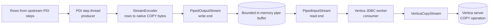
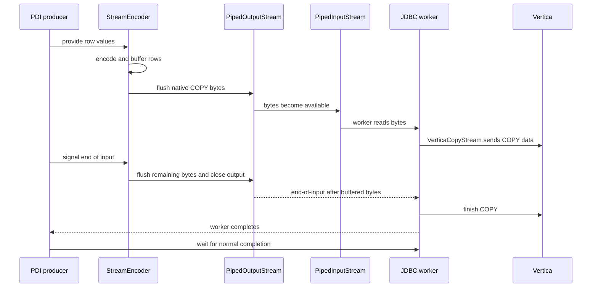
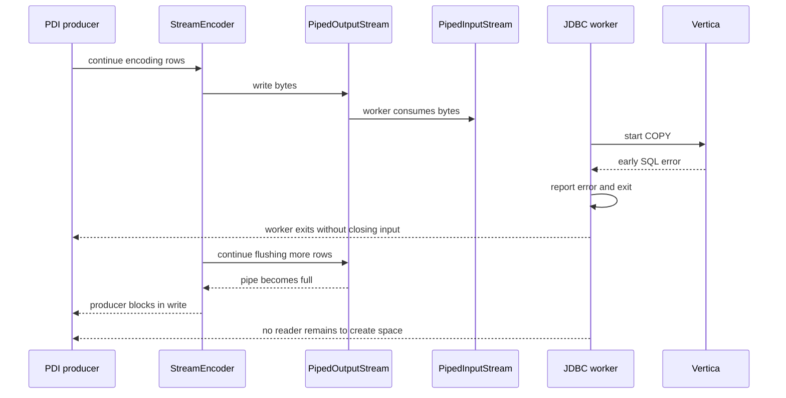
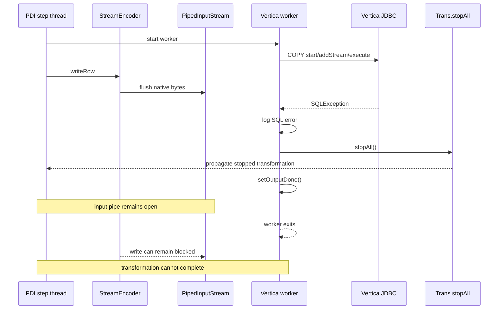
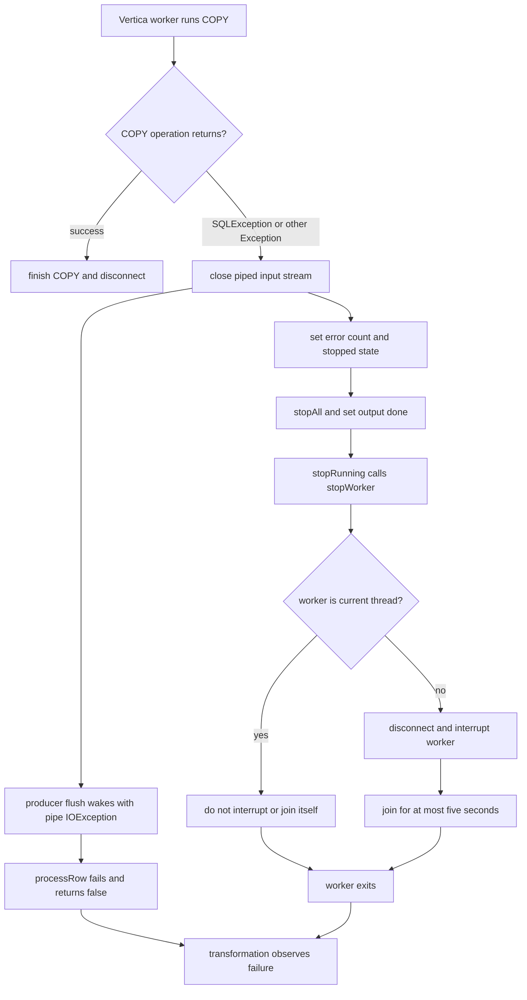

# PDI-20802: Vertica Bulk Loader hang investigation and fix

## 1. Executive summary

The hang is caused by a shutdown timing problem between two threads. It is not caused by the text of a specific Vertica error.

The step uses a Java pipe to send native COPY data. The pipe consists of a [`PipedInputStream`](core/src/main/java/org/pentaho/di/verticabulkload/VerticaBulkLoader.java#L164) and a [`PipedOutputStream`](core/src/main/java/org/pentaho/di/verticabulkload/nativebinary/StreamEncoder.java#L76). A separate [Vertica JDBC worker thread](core/src/main/java/org/pentaho/di/verticabulkload/VerticaBulkLoader.java#L340) reads from the input stream.

When Vertica returned a SQL exception, the old worker logged it, set the step error count, and [called `stopAll()`](https://github.com/pentaho/pentaho-vertica-bulkloader/blob/80d03845ff30d04df20bd04670ffe106c07e63d5/core/src/main/java/org/pentaho/di/verticabulkload/VerticaBulkLoader.java#L343-L350). However, it did not close the input side of the pipe. The worker could exit while the main transformation thread was still writing. That thread could then remain blocked in [`StreamEncoder`](core/src/main/java/org/pentaho/di/verticabulkload/nativebinary/StreamEncoder.java#L189) because the pipe no longer had a reader.

The old [`stopRunning()`](https://github.com/pentaho/pentaho-vertica-bulkloader/blob/80d03845ff30d04df20bd04670ffe106c07e63d5/core/src/main/java/org/pentaho/di/verticabulkload/VerticaBulkLoader.java#L523-L540) path had a second problem. It interrupted the worker and waited for it, but it did not first close the pipe or disconnect the database.

The new [`stopWorker()`](core/src/main/java/org/pentaho/di/verticabulkload/VerticaBulkLoader.java#L593) method handles cleanup in one place. It closes the pipe first, disconnects, interrupts the worker, avoids waiting for the current thread to finish itself, and limits forced waiting to five seconds. [The worker is also a daemon thread](core/src/main/java/org/pentaho/di/verticabulkload/VerticaBulkLoader.java#L372), so it cannot keep the JVM alive by itself.

Normal end-of-input uses a different path. It [waits for the worker](core/src/main/java/org/pentaho/di/verticabulkload/VerticaBulkLoader.java#L615) before disconnecting. This allows a successful COPY to finish normally instead of being cut short by failure cleanup.

Live tests used PDI 10.2 and Vertica 24.1. The fixed plugin exited promptly after a COPY permission failure, row rejection, intentional transformation abort, and abrupt server loss.

A controlled A/B test changed only the plugin JAR. With the original JAR, the permission-failure case was still hung after 30 seconds. The producer was still blocked in the pipe 18.781 seconds after Vertica error 4367. With the fixed JAR, the same KTR finished 985 ms after the same error and Pan returned status 1.

The final connection-loss test also used the fixed JAR. Pan returned status 1 only 1,334 ms after the Vertica container was killed. It left no Java process and committed zero rows. The fix does not need to match Vertica error messages, retry the operation, or handle individual cluster errors as special cases.

| Question | Answer |
| --- | --- |
| What did the user see? | A Vertica COPY exception was logged, but the PDI transformation did not finish. |
| What was actually stuck? | The PDI producer thread was blocked writing to a full Java pipe after the JDBC consumer thread had exited. |
| Why did normal stop handling fail? | It stopped the transformation but did not close the pipe that could wake the blocked producer. |
| What fixes it? | Close the pipe first. Then report the failure, disconnect, interrupt the worker, avoid waiting for the current thread, and limit forced waiting. |
| What proves the diagnosis? | Only the plugin JAR changed. The original JAR remained hung for more than 30 seconds. The fixed JAR exited 985 ms after the same Vertica error. |
| What is not claimed? | Not every Vertica exception triggers the old timing problem. The row-rejection and connection-loss runs are negative controls: they failed, but did not hang with the original JAR. |

### Plain-language view of the data path

The easiest way to picture this code is as a small conveyor belt inside the PDI Java process. PDI does not send
each row directly to Vertica. One local thread prepares rows, a local pipe temporarily holds the prepared bytes, and
another local thread reads those bytes and gives them to the Vertica JDBC driver. The JDBC driver then sends the data
over the database connection to Vertica.

| Part | Plain-language meaning | What it does |
| --- | --- | --- |
| PDI step thread | The producer | Receives rows from the previous PDI step and calls `processRow()`. |
| `StreamEncoder` | The translator and packer | Converts PDI values into Vertica native COPY bytes, keeps a small batch in memory, and flushes that batch to the pipe. |
| `PipedOutputStream` | The write end of the local pipe | Accepts bytes from `StreamEncoder`. It is not a network connection. |
| `PipedInputStream` | The read end of the local pipe | Supplies those bytes to the worker thread. It is connected to the `PipedOutputStream` in the same JVM. |
| Vertica JDBC worker | The consumer | Reads from `PipedInputStream`, runs `VerticaCopyStream`, and reports COPY results or errors. |
| Vertica server | The database | Receives the COPY stream over JDBC and writes or rejects the rows. |



The two `Piped*Stream` objects are two ends of one small, bounded, in-memory handoff:

- `PipedOutputStream.write()` puts bytes into the handoff.
- `PipedInputStream.read()` takes bytes out of the handoff.
- If the handoff is empty, the reader waits. That is normal: the worker is waiting for the producer to make more data.
- If the handoff is full, the writer waits. That is also normal while the worker is still reading, because the writer is waiting for space.
- If the worker stops reading and nobody closes the pipe, the handoff eventually becomes full and the producer can wait forever.

The pipe is therefore a flow-control mechanism, not just a data container. It lets the producer and consumer work at
different speeds, but it also means that stopping one side must wake the other side.

#### Normal successful load

During a healthy load, the producer and worker move together. `StreamEncoder` may hold several rows before flushing
them. When the input ends, `data.close()` tells the encoder to flush its remaining bytes and close the
`PipedOutputStream`. The worker then sees end-of-input, completes `execute()` and `finish()`, and the normal cleanup
path waits for that worker before disconnecting the database.



#### Early failure and the original hang

The important failure is not simply that Vertica returns an error. The important timing is that the worker can stop
reading early, while the producer is still trying to send a large amount of data.



At this point, `stopAll()` can mark the transformation as stopped, but that does not close the Java pipe. Downstream
PDI steps may know that no more rows are coming, but the producer can still be stuck inside
`PipedOutputStream.write()`. Because `processRow()` cannot return, Pan cannot finish the transformation cleanly.

#### Why closing the pipe causes either recovery or an error

Closing a stream is a signal about which side is finished. It is not interchangeable with stopping a PDI step:

| Operation | What the other side sees | Correct use |
| --- | --- | --- |
| Close `PipedOutputStream` after all rows are sent | The reader eventually sees end-of-input | Normal completion. The worker can finish COPY. |
| Close `PipedInputStream` after the worker has failed | A writer blocked on the pipe receives an `IOException` instead of waiting forever | Failure cleanup. The producer can leave `processRow()` and PDI can report the error. |
| Close either side too early | The other side can see incomplete input or an `IOException` | Incorrect if the load is still supposed to continue; it can abort a valid load. |
| Write or read after the relevant side is closed | Java reports a pipe/stream I/O error; exact wording depends on timing | This is expected evidence that the endpoint is no longer usable, not a new Vertica error. |
| Disconnect JDBC while the worker is still using the stream | The worker can receive a JDBC or socket error | Failure cleanup may do this to release a stuck COPY, but normal completion waits first. |

The fix closes `PipedInputStream` in the worker failure path because the worker is the side that knows it will no
longer read. That close deliberately makes a blocked producer fail fast with an I/O error. The producer-side catch
then reports that I/O error through PDI instead of leaving the transformation waiting. In the normal success path,
the output side is closed only after the encoder has flushed its remaining bytes, so the same mechanism means
end-of-input rather than failure.

### Reading path

The report is organized in the order needed to understand and verify the change:

1. [Follow the failure from the Vertica exception to the blocked PDI thread](#2-the-problem-in-order).
2. [Review the evidence and environmental assumptions](#3-investigation-basis).
3. [Reproduce the result and compare the original and fixed artifacts](#4-live-reproduction-and-validation).
4. [Inspect the original flow, fixed flow, and detailed root cause](#5-original-control-flow).
5. [Review the implementation, tests, acceptance criteria, and remaining limitation](#9-changes-made).

Readers looking for the shortest proof can go directly to [the original-versus-fixed A/B result](#original-versus-fixed-live-ab). Readers preparing the environment can go directly to [the Vertica test setup](#vertica-test-setup).

## 2. The problem in order

The failure involves two threads connected by a Java pipe with limited capacity:

- **Producer:** the main PDI step thread encodes rows and writes native COPY bytes through [`StreamEncoder`](core/src/main/java/org/pentaho/di/verticabulkload/nativebinary/StreamEncoder.java#L141-L203).
- **Consumer:** a separate [Vertica JDBC worker](core/src/main/java/org/pentaho/di/verticabulkload/VerticaBulkLoader.java#L340-L373) reads those bytes and performs the COPY operation.

The original failure sequence is:

1. PDI starts the producer and Vertica worker.
2. The producer continues generating and buffering rows.
3. Vertica rejects COPY early, as demonstrated by permission error 4367.
4. The original worker logs the exception, marks the transformation stopped, and exits, but [does not close the input pipe](https://github.com/pentaho/pentaho-vertica-bulkloader/blob/80d03845ff30d04df20bd04670ffe106c07e63d5/core/src/main/java/org/pentaho/di/verticabulkload/VerticaBulkLoader.java#L343-L350).
5. The producer fills the pipe and blocks in [`PipedOutputStream.write`](core/src/main/java/org/pentaho/di/verticabulkload/nativebinary/StreamEncoder.java#L193-L203) because no consumer remains.
6. The producer cannot return from [`processRow()`](core/src/main/java/org/pentaho/di/verticabulkload/VerticaBulkLoader.java#L77-L208), so Pan cannot complete the transformation or continue normal job-level error handling.

The fix changes the failure order:

1. One [catch block handles any exception from the worker COPY sequence](core/src/main/java/org/pentaho/di/verticabulkload/VerticaBulkLoader.java#L347-L367).
2. The worker closes the pipe before it reports that the step has stopped with an error.
3. Closing the read side wakes a producer blocked in the corresponding write.
4. Forced cleanup disconnects and interrupts the worker. It does not wait for the current thread to finish itself, and it [waits no more than five seconds for another worker thread](core/src/main/java/org/pentaho/di/verticabulkload/VerticaBulkLoader.java#L593-L613).
5. The step exits with an error, allowing Pan and any parent job to continue their normal failure path.
6. Successful end-of-input follows a separate [normal-completion wait](core/src/main/java/org/pentaho/di/verticabulkload/VerticaBulkLoader.java#L615-L625). This prevents failure cleanup from interrupting a valid COPY.

The problem depends on when the failure occurs, not on the error message. The permission-denied KTR is the test that reliably reproduces the hang. In that case, COPY fails before a working reader consumes the high-volume stream.

The row-rejection and connection-loss tests are negative controls. Row rejection happens at [`finish()`](core/src/main/java/org/pentaho/di/verticabulkload/VerticaBulkLoader.java#L352), after all rows have been sent. Connection loss happens after the driver has already consumed a large active stream. These cases produce Vertica errors, but the original plugin exited promptly with those timings. For that reason, the [live A/B evidence](#original-versus-fixed-live-ab) does not claim that every Vertica exception hangs the original plugin.

The mergeout queue-bloat KTR is a different test again. It reproduces the Vertica Health Watchdog condition and is
expected to complete successfully; it is not evidence that the mergeout KTR failed with the original plugin. The
before/after hang evidence comes from `pdi20802_permission_denied.ktr` and from the self-join unit regression below.

## 3. Investigation basis

Inspected code:

- [`VerticaBulkLoader.java`](core/src/main/java/org/pentaho/di/verticabulkload/VerticaBulkLoader.java#L77)
- [`VerticaBulkLoaderData.java`](core/src/main/java/org/pentaho/di/verticabulkload/VerticaBulkLoaderData.java#L35)
- [`StreamEncoder.java`](core/src/main/java/org/pentaho/di/verticabulkload/nativebinary/StreamEncoder.java#L66)
- [`VerticaBulkLoaderTest.java`](core/src/test/java/org/pentaho/di/verticabulkload/VerticaBulkLoaderTest.java#L360)
- [`StreamEncoderTest.java`](core/src/test/java/org/pentaho/di/verticabulkload/nativebinary/StreamEncoderTest.java#L47)

Runtime evidence:

- The project selects Vertica JDBC driver [`06.00.0000`](pom.xml#L29) in dependency management.
- The supplied PDI client is version `10.2.0.9-418`. It uses the same synchronous stop sequence as the [worker failure call](core/src/main/java/org/pentaho/di/verticabulkload/VerticaBulkLoader.java#L361-L367) and the step's [`stopRunning(...)` method](core/src/main/java/org/pentaho/di/verticabulkload/VerticaBulkLoader.java#L541-L548). Here, synchronous means that the caller waits while the stop work runs.
- Runtime bytecode inspection confirmed that stopping a transformation immediately dispatches a stop request to each step and calls that step's stop-running callback.
- Repository commit [`80d03845ff30d04df20bd04670ffe106c07e63d5`](https://github.com/pentaho/pentaho-vertica-bulkloader/tree/80d03845ff30d04df20bd04670ffe106c07e63d5) contains the code from before this fix. Historical source links below point to that commit.
- The inspected JDBC driver provides no public close or cancel operation for [`VerticaCopyStream`](core/src/main/java/org/pentaho/di/verticabulkload/VerticaBulkLoader.java#L347-L354). The plugin can stop local work only by closing the input pipe and disconnecting from the database.
- The failure-matrix server used image `repo.pentaho.com/pntprv-docker-3rdparty-release/vertica-ce:24.1.0-0`, database `vmart`, on port 5433. The separate mergeout reproduction used `opentext/vertica-k8s:24.4.0-1-multiarch`, database `vmart`, with SQL published on port 5544.
- The exact legacy driver was installed into PDI 10.2 `lib`; its SHA-256 is `3FEA0CA1EAD071D3A1CE022232D19C8200E889B2B657575FA1B9B551A11DD224`.
- [Nine checked-in KTRs](samples/pdi20802/README.md#L20-L30) cover successful end-of-input, metadata failure, SQL failure in the worker, type mapping, both row-rejection modes, PDI abort, server loss, and mergeout queue bloat.
- [Unit tests](core/src/test/java/org/pentaho/di/verticabulkload/VerticaBulkLoaderTest.java#L360-L655) mock each COPY stage so timing is repeatable. The live KTRs test the same paths with the real PDI runtime, JDBC driver, and Vertica server.

## 4. Live reproduction and validation

The failure matrix and original-versus-fixed A/B test used a disposable Vertica 24.1.0-0 container and a database named `vmart`, matching the integration-test convention. The exact mergeout queue-bloat reproduction used a separate disposable Vertica 24.4.0-1 container because the 24.1 image did not expose `MergeoutBlockParameter`. Everything needed to repeat both paths is under `samples/pdi20802/`: the [KTR test matrix and run instructions](samples/pdi20802/README.md#L1), the [24.4 bootstrap and evidence procedure](samples/pdi20802/README.md#exact-vertica-24-4-mergeout-queue-bloat-probe), and the [database setup script](samples/pdi20802/setup.sql#L1) for the 24.1 matrix.

### Vertica test setup

To run the probes, you need Docker, free local port 5433, and a PDI runtime with the fixed plugin deployed. The PDI `lib` directory must also contain `vertica-jdbc-driver-06.00.0000.jar`, the [legacy JDBC version declared by this project](pom.xml#L29-L38). The KTR files contain the following connection values directly; they do not read them from environment variables:

| Connection setting | Value |
| --- | --- |
| Type | `VERTICA5` / Native |
| Host and port | `localhost:5433` |
| Database | `vmart` |
| Main user | `dbadmin`, empty password |
| Permission-failure user | `pdi20802_reader`, empty password |
| Connection pooling | Disabled |

The empty passwords are intentional. The restricted user and empty passwords must be used only with this disposable container published on the local machine. Start the exact test image from PowerShell:

```powershell
docker run --detach `
  --name pdi20802-vertica-live `
  --publish 5433:5433 `
  --env VERTICA_DB_NAME=vmart `
  repo.pentaho.com/pntprv-docker-3rdparty-release/vertica-ce:24.1.0-0
```

Wait until Vertica accepts connections, then confirm the server, database, and user:

```powershell
do {
  docker exec pdi20802-vertica-live /opt/vertica/bin/vsql `
    -X -At -U dbadmin -d vmart -c "SELECT 1;" 2>$null
  if ($LASTEXITCODE -ne 0) { Start-Sleep -Seconds 2 }
} until ($LASTEXITCODE -eq 0)

docker exec pdi20802-vertica-live /opt/vertica/bin/vsql `
  -X -At -U dbadmin -d vmart `
  -c "SELECT version(), current_database(), current_user;"
```

The identity probe must report:

```text
Vertica Analytic Database v24.1.0-0|vmart|dbadmin
```

From the repository root, use [`setup.sql`](samples/pdi20802/setup.sql#L1-L31) to reset and create the test objects. The script drops or changes only objects whose names start with `pdi20802_`. You can safely rerun it before one probe or before the full test matrix:

```powershell
Set-Location .\samples\pdi20802
Get-Content .\setup.sql |
  docker exec -i pdi20802-vertica-live /opt/vertica/bin/vsql `
    -X -v ON_ERROR_STOP=1 -U dbadmin -d vmart -f -
```

[`setup.sql`](samples/pdi20802/setup.sql#L1-L31) creates the following controlled conditions:

| Object | Purpose |
| --- | --- |
| [`public.pdi20802_success (id INTEGER, payload VARCHAR(64))`](samples/pdi20802/setup.sql#L8-L11) | Valid-load baseline and existing table used by the permission probe. |
| [`public.pdi20802_unsupported (id INTEGER, payload INTERVAL YEAR TO MONTH)`](samples/pdi20802/setup.sql#L13-L16) | Exposes a real Vertica type the plugin cannot map. |
| [`public.pdi20802_narrow (id INTEGER, payload VARCHAR(4))`](samples/pdi20802/setup.sql#L18-L21) | Forces deterministic rejection of the value `TOO-LONG`. |
| [`public.pdi20802_large (id INTEGER, payload VARCHAR(512))`](samples/pdi20802/setup.sql#L23-L26) | Long-running target for manual abort and connection-loss tests. |
| [`public.pdi20802_missing`](samples/pdi20802/setup.sql#L5) | Explicitly dropped and deliberately not recreated. |
| [`pdi20802_reader`](samples/pdi20802/setup.sql#L28-L31) | Passwordless local test user with schema usage and `SELECT` on `pdi20802_success`, but no load privilege. |

Run a probe from that directory with PDI 10.2. The example below runs the success case. Replace the KTR filename to run another case. The next table identifies the intentional failure probes, for which exit status 1 is expected.

```powershell
$env:PDI_HOME = 'D:\Software-D\pdi-ee-client-10.2.0.9-418\data-integration'
& "$env:PDI_HOME\Pan.bat" "/file:$PWD\pdi20802_success.ktr" /level:Basic
$LASTEXITCODE
```

### Exact Vertica 24.4 mergeout reproduction

The 24.1 image was not suitable for the requested mergeout reproduction: it did not expose
`MergeoutBlockParameter`. The exact condition was reproduced separately with
`opentext/vertica-k8s:24.4.0-1-multiarch` in container `vertica_24_4_pdi20802`. The container published SQL as
`localhost:5544 -> 5433` and embedded HTTPS as `localhost:8444 -> 8443`. The server reported
`Vertica Analytic Database v24.4.0-1`, database `vmart`, node `v_vmart_node0001`, and catalog
`/home/dbadmin/data/vmart/v_vmart_node0001_catalog`.

This image is an operator/Kubernetes image, not a ready standalone database. The disposable instance required a
persistent `/home/dbadmin/data` volume, ownership `998:996`, manual single-node `vcluster create_db` bootstrap, and
mutual TLS for the node-management agent. The agent configuration had to contain PEM contents in `httpstls.json`.
The client certificate used for readiness checks was `/opt/vertica/config/https_certs/998.pem` with key
`/opt/vertica/config/https_certs/998.key`; its common name was `998` and its extended key usage was `clientAuth`.
If bootstrap cleanup removed `vertica_cluster.yaml` but left the catalog, the existing node was started directly with:

```text
/opt/vertica/bin/vertica -D /home/dbadmin/data/vmart/v_vmart_node0001_catalog -C vmart -n v_vmart_node0001 -h 127.0.0.1 -p 5433 -P 4803 -Y ipv4
```

The database user was numeric `998` with password `vertica`. The legacy JDBC driver sends MD5 authentication, while
Vertica 24.4 defaults to SHA512, so the disposable database granted the user narrowly scoped trust authentication for
local and Docker bridge connections. The node-management TLS record was also granted to the user:

```sql
CREATE AUTHENTICATION pdi_tls METHOD 'tls' HOST TLS '127.0.0.1/32';
GRANT AUTHENTICATION pdi_tls TO "998";
CREATE AUTHENTICATION pdi_trust_local METHOD 'trust' LOCAL;
CREATE AUTHENTICATION pdi_trust_docker METHOD 'trust' HOST '172.17.0.0/16';
GRANT AUTHENTICATION pdi_trust_local TO "998";
GRANT AUTHENTICATION pdi_trust_docker TO "998";
ALTER DATABASE vmart SET MergeoutBlockParameter = 1;
ALTER DATABASE vmart SET MaxClientSessions = 400;
```

The target was created separately from the 24.1 [`setup.sql`](samples/pdi20802/setup.sql#L1-L31) objects:

```sql
CREATE TABLE public.pdi20802_mergeout (
  id INTEGER,
  payload VARCHAR(128)
);
```

The checked-in [`pdi20802_mergeout_queue_bloat.ktr`](samples/pdi20802/pdi20802_mergeout_queue_bloat.ktr) generated
131,072 rows and used 128 loader copies, approximately 1,024 rows per COPY stream. It connected to `localhost:5544`
as user `998` and used `MergeoutBlockParameter=1`. For a foreground evidence run, Pan was launched through the PDI
launcher with main class `org.pentaho.di.pan.Pan` and these workload arguments:

```text
-main org.pentaho.di.pan.Pan
-initialDir D:\tickets\PDI-20802\pentaho-vertica-bulkloader\samples\pdi20802\
/file:pdi20802_mergeout_queue_bloat.ktr /level:Basic
```

The direct Java launch used `C:\Pentaho\java\bin\java.exe` and the PDI `launcher\launcher.jar` from
`D:\Software-D\pdi-ee-client-10.2.0.9-418\data-integration`. Direct ownership was used for the final evidence
because some local `Pan.bat` launchers detach their Java child and obscure the exit code. The complete bootstrap,
authentication, launch, and cleanup commands are recorded in the [probe README](samples/pdi20802/README.md#exact-vertica-24-4-mergeout-queue-bloat-probe).

### Exact mergeout evidence

The final run truncated `public.pdi20802_mergeout` before starting. Pan returned exit code `0` and logged:

```text
Pan - Finished!
Pan - Start=2026/09/11 13:17:50.380, Stop=2026/09/11 13:17:54.676
Pan - Processing ended after 4 seconds.
```

Post-run checks reported `131072` rows in the target, `MergeoutBlockParameter=1`, and zero rows in
`v_monitor.database_connections`. No process matching the KTR or `org.pentaho.di.pan.Pan` remained.

The Vertica log recorded the exact Health Watchdog condition as three detection/resolution pairs. The container log
clock is shown as recorded and is one hour behind the host Pan timestamps:

```text
2026-09-11 12:17:53.990 Detected MERGEOUT QUEUE BLOAT. Blocking DML/DDLs.
2026-09-11 12:17:53.999 Resolved MERGEOUT QUEUE BLOAT. Unblocking DML/DDLs.
2026-09-11 12:17:54.238 Detected MERGEOUT QUEUE BLOAT. Blocking DML/DDLs.
2026-09-11 12:17:54.480 Resolved MERGEOUT QUEUE BLOAT. Unblocking DML/DDLs.
2026-09-11 12:17:54.498 Detected MERGEOUT QUEUE BLOAT. Blocking DML/DDLs.
2026-09-11 12:17:54.641 Resolved MERGEOUT QUEUE BLOAT. Unblocking DML/DDLs.
```

The log also contains `Enabling Health Watchdog Mergeout Module`. The `Detected MERGEOUT QUEUE BLOAT` and
`Resolved MERGEOUT QUEUE BLOAT` lines are the decisive server-side evidence. This workload did not hang: it completed
successfully, committed all expected rows, released its database sessions, and left no Pan or Java process behind.

For the before/after question, the same KTR was rerun after replacing the fixed deployment with the untouched vendor
JAR and truncating the target again. The vendor JAR also returned Pan exit code `0` in about three seconds, committed
131,072 rows, and produced the Health Watchdog detection/resolution events. The mergeout KTR therefore passes with
both plugin versions; it is not the failing regression. The failing before/after cases are the permission-denied live
KTR and the self-join unit regression described below.

### What each KTR does

Every probe explicitly maps generated fields `id` and `PAYLOAD` to Vertica columns `id` and `payload`. Each probe also uses a different stream name. This makes its COPY operation easy to identify in PDI and Vertica logs. The table records results observed with the final fixed JAR.

| KTR | Input and failure trigger | Code path being tested | Expected and observed result |
| --- | --- | --- | --- |
| [`pdi20802_success.ktr`](samples/pdi20802/pdi20802_success.ktr#L118-L153) | Generates 10,000 sequential IDs with constant payload `PDI-20802 baseline`, then loads `pdi20802_success` with `ABORT ON ERROR`. | Normal end-of-input (EOF), worker [`finish()`](core/src/main/java/org/pentaho/di/verticabulkload/VerticaBulkLoader.java#L352), and successful cleanup. | Pan 0; exactly 10,000 rows committed; transformation completed in 1 second. |
| [`pdi20802_missing_table.ktr`](samples/pdi20802/pdi20802_missing_table.ktr#L44-L50) | Starts a one-million-row generator targeting deliberately absent `pdi20802_missing`. | Target metadata lookup before COPY starts. This is a control failure, not a worker-thread failure. | Pan 1; upstream stopped with a full rowset after 9,936 rows; the table remained absent; transformation completed in 1 second. |
| [`pdi20802_permission_denied.ktr`](samples/pdi20802/pdi20802_permission_denied.ktr#L14-L29) | Starts a one-million-row load into existing `pdi20802_success` as `pdi20802_reader`. The user can read metadata but cannot load the table. | Real authorization `SQLException` from the worker's COPY [`execute()` path](core/src/main/java/org/pentaho/di/verticabulkload/VerticaBulkLoader.java#L351). | Vertica error 4367; Pan 1; target count unchanged; no secondary cleanup warning. |
| [`pdi20802_unsupported_type.ktr`](samples/pdi20802/pdi20802_unsupported_type.ktr#L17-L22) | Generates one row for `pdi20802_unsupported`, whose payload is `INTERVAL YEAR TO MONTH`. | Plugin column-spec mapping before data is sent. | Pan 1 with `Column type INTERVAL YEAR TO MONTH not supported.`; zero rows loaded. |
| [`pdi20802_row_rejection_abort.ktr`](samples/pdi20802/pdi20802_row_rejection_abort.ktr#L17-L22) | Sends 100 rows containing `TOO-LONG` to the `VARCHAR(4)` payload in `pdi20802_narrow`, with `ABORT ON ERROR` enabled. | Server-side COPY rejection propagated as a worker failure. | Pan 1; Vertica error 2035 on the first rejected value; zero rows committed. |
| [`pdi20802_row_rejection_continue.ktr`](samples/pdi20802/pdi20802_row_rejection_continue.ktr#L17-L22) | Sends the same 100 oversized rows to `pdi20802_narrow`, with `ABORT ON ERROR` disabled. | Successful COPY completion with rejected rows, documenting existing non-abort semantics. | Pan 0; `0 records loaded out of 100 records sent`; zero rows committed. |
| [`pdi20802_manual_abort.ktr`](samples/pdi20802/pdi20802_manual_abort.ktr#L20-L30) | Generates up to one million rows and passes them through an Abort step before loading `pdi20802_large`; its threshold of 50,000 triggers the stop on row 50,001. | Synchronous PDI [`stopAll()`](core/src/main/java/org/pentaho/di/verticabulkload/VerticaBulkLoader.java#L541-L548) and forced COPY cancellation while producer and worker are active. | Abort at row 50,001; COPY logged normal interruption; Pan 1; zero rows committed. |
| [`pdi20802_connection_loss.ktr`](samples/pdi20802/pdi20802_connection_loss.ktr#L17-L22) | Generates up to 100 million rows for `pdi20802_large`; the Vertica container is killed during active COPY. | Real socket failure from the worker's COPY [`execute()` path](core/src/main/java/org/pentaho/di/verticabulkload/VerticaBulkLoader.java#L351) while the producer is still writing. | Server killed after 2.36 million loader rows; Pan 1 after 1,334 ms; no Java process remained; zero rows after restart. |
| [`pdi20802_mergeout_queue_bloat.ktr`](samples/pdi20802/pdi20802_mergeout_queue_bloat.ktr) | Generates 131,072 rows into `pdi20802_mergeout` through 128 loader copies with `MergeoutBlockParameter=1` on Vertica 24.4. | Real server Health Watchdog mergeout queue-bloat blocking and resolution while COPY streams are active. | Fixed and untouched vendor JARs both returned Pan 0; 131,072 rows committed; detection/resolution pairs were logged; zero active sessions; no Pan or Java process remained. |

### Original-versus-fixed live A/B

On 2026-09-10, the permission probe was run twice. Both runs used the same PDI 10.2.0.9-418 installation, Vertica 24.1.0-0 container, JDBC driver, [`setup.sql`](samples/pdi20802/setup.sql#L1-L31) reset, and [`pdi20802_permission_denied.ktr`](samples/pdi20802/pdi20802_permission_denied.ktr#L14-L29). Only the deployed plugin JAR changed.

An external test harness stopped the original run after 30 seconds. This limit prevented the known hang from leaving Pan running indefinitely.

| Artifact | SHA-256 | Observed result |
| --- | --- | --- |
| Untouched PDI 10.2 vendor JAR | `273448B0E7D9950E7C94A0B6051CF710854A7264E44FB66AF2F7FA35CB931B5F` | Vertica error 4367 was logged at `15:45:02.219`. Pan still had not exited at the 30.052-second harness limit. A JVM dump captured at `15:45:21` showed the producer still blocked 18.781 seconds after the error; the harness then terminated that test process. |
| Fixed JAR | `B280B6788C123772D23A7259992BA4C2E645DFBCEBEB3B017A9F56910974BA2F` | The same Vertica error 4367 was logged at `15:38:39.507`; `Pan - Finished!` followed at `15:38:40.492`, 985 ms later. Pan returned status 1, the target remained at zero rows, and no Java process remained. |

The JVM dump from the original JAR showed the `pdi20802_permission_denied - Vertica bulk loader` step thread in `TIMED_WAITING`. In other words, the step thread was still alive but waiting. The dump showed this exact chain of calls:

```text
PipedInputStream.awaitSpace
  -> PipedOutputStream.write
  -> StreamEncoder.flushBuffer
  -> StreamEncoder.checkAndFlushBuffer
  -> StreamEncoder.writeRow
  -> VerticaBulkLoader.writeToOutputStream
  -> VerticaBulkLoader.processRow
```

The stack matches the current [`StreamEncoder` code that flushes data into the pipe](core/src/main/java/org/pentaho/di/verticabulkload/nativebinary/StreamEncoder.java#L193-L203) and the loader's [`processRow()` write code](core/src/main/java/org/pentaho/di/verticabulkload/VerticaBulkLoader.java#L178-L205). The original JDBC worker had already exited, so it did not appear in the dump.

With the fix, the worker catch block [closes the pipe before it reports the stopped/error state](core/src/main/java/org/pentaho/di/verticabulkload/VerticaBulkLoader.java#L355-L367). Closing the read side causes the blocked write to return with an error. The step can then return, which allows Pan to finish waiting for the transformation.

Two tests with the original JAR act as negative controls. They explain why some Vertica failures did not reproduce the hang:

| KTR with original JAR | Observed result | Why it differs from the permission test that hangs |
| --- | --- | --- |
| [`pdi20802_row_rejection_abort.ktr`](samples/pdi20802/pdi20802_row_rejection_abort.ktr#L17-L22) | Vertica error 2035 was returned from [`VerticaCopyStream.finish()`](core/src/main/java/org/pentaho/di/verticabulkload/VerticaBulkLoader.java#L352); Pan reached `Finished!` 9 ms later. | All 100 rows and the end-of-input signal had already reached the driver. No producer remained blocked when Vertica rejected the first row during final COPY processing. |
| [`pdi20802_connection_loss.ktr`](samples/pdi20802/pdi20802_connection_loss.ktr#L17-L22) | Vertica error 100024 was returned from [`VerticaCopyStream.execute()`](core/src/main/java/org/pentaho/di/verticabulkload/VerticaBulkLoader.java#L351); the original Pan process exited 729 ms after `docker kill` returned. | COPY had already consumed a large active stream. The prompt exit is consistent with the pipe having an established reader whose death the writer can detect, unlike the early permission rejection. |

The test that reproduces the hang has two required conditions: the worker fails early, and a high-volume producer can fill a pipe that has no working reader.

The other probes test different behavior. The missing-table and unsupported-type probes fail before the worker starts COPY. The success and continue-on-rejection probes do not cause a fatal worker exception. The manual-abort probe tests how PDI stops the step, not how the plugin handles a Vertica exception. These tests still provide useful coverage, but they are not presented as reproductions of the original hang.

The connection-loss probe requires two shells. Start Pan in the first shell. Wait until both field-mapping messages appear in the log, which confirms that COPY is active. Then stop the server from the second shell. Restart the same container, wait until `vsql` is ready as shown above, and verify that the failed COPY committed no partial data:

```powershell
docker kill pdi20802-vertica-live
docker start pdi20802-vertica-live

docker exec pdi20802-vertica-live /opt/vertica/bin/vsql `
  -X -At -U dbadmin -d vmart `
  -c "SELECT COUNT(*) FROM public.pdi20802_large;"
```

The count must be zero. To remove the disposable server and its anonymous data volume after testing, run `docker rm --force --volumes pdi20802-vertica-live`.

The missing-table case fails before COPY because PDI first asks the database for information about the target table. The permission-denied and connection-loss cases both reach [`VerticaCopyStream.execute()`](core/src/main/java/org/pentaho/di/verticabulkload/VerticaBulkLoader.java#L347-L358). Both return a real `SQLException` through the same catch block.

However, only the early permission rejection reliably recreates the original blocked writer. The A/B result demonstrates this difference. The connection-loss case still proves that the fixed code handles a real network socket exception.

The continue-on-rejection result records an existing behavior that this fix does not change. PDI can report rows as processed downstream even when Vertica rejects every row. In this case, use the worker's `0 records loaded` message and the target table row count as the actual load result.

The live tests use safe, repeatable failures. They do not try to fill a disk or overload the mergeout queue. Cluster-health exceptions caused by those resource problems would still reach the same worker catch block.

## 5. Original control flow



The diagram shows the live permission-failure reproduction. The worker had already exited, so it was absent from the thread dump. The producer was still present and blocked.

The [original worker catch block](https://github.com/pentaho/pentaho-vertica-bulkloader/blob/80d03845ff30d04df20bd04670ffe106c07e63d5/core/src/main/java/org/pentaho/di/verticabulkload/VerticaBulkLoader.java#L343-L350) was missing one critical operation: [closing `PipedInputStream`](core/src/main/java/org/pentaho/di/verticabulkload/VerticaBulkLoader.java#L583-L590). Interrupting the JDBC worker does not close the pipe used by the producer. The original [`setOutputDone()` call](https://github.com/pentaho/pentaho-vertica-bulkloader/blob/80d03845ff30d04df20bd04670ffe106c07e63d5/core/src/main/java/org/pentaho/di/verticabulkload/VerticaBulkLoader.java#L347-L350) tells downstream PDI steps that no more rows will arrive, but it does not wake a blocked [`PipedOutputStream` write](core/src/main/java/org/pentaho/di/verticabulkload/nativebinary/StreamEncoder.java#L199-L203).

The original code also waited indefinitely for workers in both [`stopRunning()`](https://github.com/pentaho/pentaho-vertica-bulkloader/blob/80d03845ff30d04df20bd04670ffe106c07e63d5/core/src/main/java/org/pentaho/di/verticabulkload/VerticaBulkLoader.java#L523-L540) and [`dispose()`](https://github.com/pentaho/pentaho-vertica-bulkloader/blob/80d03845ff30d04df20bd04670ffe106c07e63d5/core/src/main/java/org/pentaho/di/verticabulkload/VerticaBulkLoader.java#L543-L573). Those waits were risky, but the A/B thread dump showed a different blocked call: the producer was waiting while writing to the pipe.

## 6. Fixed control flow



When input ends successfully, [`dispose()`](core/src/main/java/org/pentaho/di/verticabulkload/VerticaBulkLoader.java#L550-L579) does not cancel the worker. It calls [`waitForWorker()`](core/src/main/java/org/pentaho/di/verticabulkload/VerticaBulkLoader.java#L615-L625), which waits for the normal COPY work to finish. This gives [`execute()` and `finish()`](core/src/main/java/org/pentaho/di/verticabulkload/VerticaBulkLoader.java#L351-L352) time to complete before the database is disconnected.

## 7. Detailed root cause

### 1. The worker and producer are separate execution paths

[`VerticaBulkLoader.initializeWorker()`](core/src/main/java/org/pentaho/di/verticabulkload/VerticaBulkLoader.java#L340-L373) starts a separate worker thread. The worker calls:

1. [`createVerticaCopyStream()`](core/src/main/java/org/pentaho/di/verticabulkload/VerticaBulkLoader.java#L347)
2. [`stream.start()`](core/src/main/java/org/pentaho/di/verticabulkload/VerticaBulkLoader.java#L348)
3. [`stream.addStream(data.pipedInputStream)`](core/src/main/java/org/pentaho/di/verticabulkload/VerticaBulkLoader.java#L349)
4. [`stream.getRejects()`](core/src/main/java/org/pentaho/di/verticabulkload/VerticaBulkLoader.java#L350)
5. [`stream.execute()`](core/src/main/java/org/pentaho/di/verticabulkload/VerticaBulkLoader.java#L351)
6. [`stream.finish()`](core/src/main/java/org/pentaho/di/verticabulkload/VerticaBulkLoader.java#L352)

The main PDI step thread calls [`StreamEncoder.writeRow()`](core/src/main/java/org/pentaho/di/verticabulkload/nativebinary/StreamEncoder.java#L141-L181). The encoder buffers up to [`StreamEncoder.NUM_ROWS_TO_BUFFER`](core/src/main/java/org/pentaho/di/verticabulkload/nativebinary/StreamEncoder.java#L38) rows and then [writes the buffer into the pipe](core/src/main/java/org/pentaho/di/verticabulkload/nativebinary/StreamEncoder.java#L193-L203).

The Java pipe is a bounded in-memory producer/consumer queue. The PDI thread writes bytes to the `PipedOutputStream`, and the Vertica worker reads those bytes from the connected `PipedInputStream`:

```text
PDI producer thread
  PipedOutputStream.write(...)
        |
     byte buffer
        |
  PipedInputStream.read(...)
Vertica worker thread
```

`read()` waits when the pipe is empty. `write()` waits when the pipe is full. Closing the output side eventually gives the reader end-of-input, while closing the input side causes a blocked writer to receive an `IOException`. That last behavior is essential during failure cleanup: closing the `PipedInputStream` wakes a producer that is blocked because the Vertica worker has stopped reading.

### 2. SQL failure stopped only the consumer side

The original vendor JAR is identified by its SHA-256 value above. Its worker catch block logged the exception, set the error count, told PDI to stop, and marked the output as finished. The [matching code in the repository baseline performs the same steps but does not close the pipe](https://github.com/pentaho/pentaho-vertica-bulkloader/blob/80d03845ff30d04df20bd04670ffe106c07e63d5/core/src/main/java/org/pentaho/di/verticabulkload/VerticaBulkLoader.java#L343-L350). The fixed [worker catch block](core/src/main/java/org/pentaho/di/verticabulkload/VerticaBulkLoader.java#L355-L367) closes the pipe before it reports the failure.

After the JDBC worker stopped reading, the pipe could fill. The producer would then block while [writing to the pipe](core/src/main/java/org/pentaho/di/verticabulkload/nativebinary/StreamEncoder.java#L199-L203). Because the producer thread could not return from [`processRow()`](core/src/main/java/org/pentaho/di/verticabulkload/VerticaBulkLoader.java#L77-L208), PDI could not finish reporting the transformation or job failure.

### 3. Stop cleanup did not own all resources

The baseline [`stopRunning()`](https://github.com/pentaho/pentaho-vertica-bulkloader/blob/80d03845ff30d04df20bd04670ffe106c07e63d5/core/src/main/java/org/pentaho/di/verticabulkload/VerticaBulkLoader.java#L523-L540) only interrupted and joined the worker. It did not:

- close the input side of the pipe;
- disconnect the Vertica database connection before waiting;
- detect when the worker thread itself was running cleanup, which could make it wait for itself.

The new [`stopWorker()`](core/src/main/java/org/pentaho/di/verticabulkload/VerticaBulkLoader.java#L593-L613) performs all three operations. Both [`stopRunning()`](core/src/main/java/org/pentaho/di/verticabulkload/VerticaBulkLoader.java#L541-L548) and [cleanup after a failure or stop](core/src/main/java/org/pentaho/di/verticabulkload/VerticaBulkLoader.java#L570-L574) use this method. During forced cleanup, the code [waits no more than five seconds for the worker](core/src/main/java/org/pentaho/di/verticabulkload/VerticaBulkLoader.java#L600-L611). [The worker is a daemon thread](core/src/main/java/org/pentaho/di/verticabulkload/VerticaBulkLoader.java#L372). Successful cleanup uses the separate normal-completion wait described above.

## 8. Blocking-point inventory

| Blocking or termination point | How it can affect a hang | Handling after the fix |
| --- | --- | --- |
| [`getRow()`](core/src/main/java/org/pentaho/di/verticabulkload/VerticaBulkLoader.java#L85) | Waits for an upstream PDI row. | [`processRow()` checks the stopped state before and after `getRow()`](core/src/main/java/org/pentaho/di/verticabulkload/VerticaBulkLoader.java#L81-L88). PDI's normal [`stopAll()` call](core/src/main/java/org/pentaho/di/verticabulkload/VerticaBulkLoader.java#L361-L367) remains responsible for waking upstream rowsets. |
| [`StreamEncoder.writeRow()` before a flush](core/src/main/java/org/pentaho/di/verticabulkload/nativebinary/StreamEncoder.java#L141-L181) | Usually only updates the in-memory buffer. | [The stopped state is checked after the write](core/src/main/java/org/pentaho/di/verticabulkload/VerticaBulkLoader.java#L178-L181). |
| [Pipe flush from `StreamEncoder`](core/src/main/java/org/pentaho/di/verticabulkload/nativebinary/StreamEncoder.java#L193-L203) | Can block when the JDBC worker has stopped reading. This is the ticket's primary hang. | [Worker failure closes `PipedInputStream`](core/src/main/java/org/pentaho/di/verticabulkload/VerticaBulkLoader.java#L355-L358); the blocked producer receives an I/O failure and exits the step. |
| [`createVerticaCopyStream()`](core/src/main/java/org/pentaho/di/verticabulkload/VerticaBulkLoader.java#L347) | Can return a SQL or connection exception before any rows are consumed. | The same [worker catch](core/src/main/java/org/pentaho/di/verticabulkload/VerticaBulkLoader.java#L355-L367) closes the pipe, marks failure, and stops the transformation. |
| [`stream.start()`](core/src/main/java/org/pentaho/di/verticabulkload/VerticaBulkLoader.java#L348) | Can fail while COPY setup is being negotiated. | Same centralized worker failure path. |
| [`stream.addStream()`](core/src/main/java/org/pentaho/di/verticabulkload/VerticaBulkLoader.java#L349) | Can fail while attaching the input stream. | Same centralized worker failure path. |
| [`stream.getRejects()`](core/src/main/java/org/pentaho/di/verticabulkload/VerticaBulkLoader.java#L350) | Can fail while reading driver state. | Same centralized worker failure path. |
| [`stream.execute()`](core/src/main/java/org/pentaho/di/verticabulkload/VerticaBulkLoader.java#L351) | This is where the reported cluster-health exception is observed. | Same centralized worker failure path. |
| [`stream.finish()`](core/src/main/java/org/pentaho/di/verticabulkload/VerticaBulkLoader.java#L352) | Can fail while the driver finalizes the COPY. | Same centralized worker failure path. |
| [`data.db.disconnect()`](core/src/main/java/org/pentaho/di/verticabulkload/VerticaBulkLoader.java#L353) | Can block or fail during normal worker completion or cleanup. | [Stop cleanup calls it before waiting](core/src/main/java/org/pentaho/di/verticabulkload/VerticaBulkLoader.java#L596-L604); live server-loss validation returned promptly. The legacy API provides no independent timeout. |
| [Forced worker join](core/src/main/java/org/pentaho/di/verticabulkload/VerticaBulkLoader.java#L600-L611) | Can wait for a driver call that ignores interruption. | A non-current worker is joined for at most five seconds; timeout marks the step failed. A current worker is never joined by itself. |
| [Normal end-of-input wait](core/src/main/java/org/pentaho/di/verticabulkload/VerticaBulkLoader.java#L615-L623) | [Waits for `execute()` and `finish()`](core/src/main/java/org/pentaho/di/verticabulkload/VerticaBulkLoader.java#L351-L352) so a valid COPY can complete. | Has no time limit while the step is healthy and running normally. This remaining limitation comes from the driver. |
| [Failure rollback](core/src/main/java/org/pentaho/di/verticabulkload/VerticaBulkLoader.java#L560-L568) | A connection may already be closed by worker cleanup. | Rollback runs only when the JDBC connection exists and is open, avoiding a secondary exception after the primary COPY failure. |
| [`setOutputDone()`](core/src/main/java/org/pentaho/di/verticabulkload/VerticaBulkLoader.java#L361-L367) | Tells downstream PDI steps that no more rows will arrive, but does not close the input pipe. | Still used to report completion to PDI, together with explicit pipe and database cleanup. |
| [`putRow()`](core/src/main/java/org/pentaho/di/verticabulkload/VerticaBulkLoader.java#L182-L186) | May wait if the next PDI step cannot accept rows quickly enough. | The step checks the stopped state after producing a row and marks output done on failure. PDI is responsible for stopping downstream row queues. |
| log file operations | File open/write/close can fail, but these are ordinary I/O failures rather than the Vertica pipe deadlock. | Existing error handling remains in place. |

## 9. Changes made

### Production code

[`VerticaBulkLoader.java`](core/src/main/java/org/pentaho/di/verticabulkload/VerticaBulkLoader.java#L77) now:

- [checks `isStopped()` before and after `getRow()`](core/src/main/java/org/pentaho/di/verticabulkload/VerticaBulkLoader.java#L81-L88) and [after writing a row](core/src/main/java/org/pentaho/di/verticabulkload/VerticaBulkLoader.java#L178-L181);
- [treats row-write `IOException` as a real step failure](core/src/main/java/org/pentaho/di/verticabulkload/VerticaBulkLoader.java#L199-L205) instead of printing a stack trace and continuing;
- [handles exceptions from the complete worker COPY sequence](core/src/main/java/org/pentaho/di/verticabulkload/VerticaBulkLoader.java#L347-L367) through one catch path;
- [closes the piped input stream immediately](core/src/main/java/org/pentaho/di/verticabulkload/VerticaBulkLoader.java#L355-L358) when the worker fails;
- [marks the step stopped and reports the error through `setErrors(1)`, `stopAll()`, and `setOutputDone()`](core/src/main/java/org/pentaho/di/verticabulkload/VerticaBulkLoader.java#L361-L367);
- [centralizes worker cleanup in `stopWorker()`](core/src/main/java/org/pentaho/di/verticabulkload/VerticaBulkLoader.java#L593-L613);
- [disconnects the database before waiting](core/src/main/java/org/pentaho/di/verticabulkload/VerticaBulkLoader.java#L594-L604) for a non-current worker;
- [marks the worker daemon](core/src/main/java/org/pentaho/di/verticabulkload/VerticaBulkLoader.java#L372) and [bounds forced join to five seconds](core/src/main/java/org/pentaho/di/verticabulkload/VerticaBulkLoader.java#L604-L608);
- [preserves the interrupt flag](core/src/main/java/org/pentaho/di/verticabulkload/VerticaBulkLoader.java#L609-L611) if the thread performing cleanup is interrupted;
- [avoids interrupting or joining the current worker](core/src/main/java/org/pentaho/di/verticabulkload/VerticaBulkLoader.java#L600-L604) when cleanup is invoked by that worker itself;
- [preserves successful end-of-input](core/src/main/java/org/pentaho/di/verticabulkload/VerticaBulkLoader.java#L570-L575) by waiting for the worker to finish COPY before disconnecting;
- [skips rollback when the JDBC connection is absent or already closed](core/src/main/java/org/pentaho/di/verticabulkload/VerticaBulkLoader.java#L560-L568).

The fix does not inspect Vertica error text, retry COPY, or add special handling for mergeout queue bloat. Instead, every exception from the COPY sequence follows the same cleanup path. Future Vertica cluster-health errors will therefore receive the same handling.

### Tests

[`VerticaBulkLoaderTest.java`](core/src/test/java/org/pentaho/di/verticabulkload/VerticaBulkLoaderTest.java#L360) now includes:

- [a real blocked-pipe regression synchronized at `WritableByteChannel.write()`](core/src/test/java/org/pentaho/di/verticabulkload/VerticaBulkLoaderTest.java#L360-L408);
- [every COPY stage](core/src/test/java/org/pentaho/di/verticabulkload/VerticaBulkLoaderTest.java#L591-L620): create, start, add stream, reject lookup, execute, and finish;
- [worker runtime exceptions](core/src/test/java/org/pentaho/di/verticabulkload/VerticaBulkLoaderTest.java#L622-L625) and [EOF-flush failure](core/src/test/java/org/pentaho/di/verticabulkload/VerticaBulkLoaderTest.java#L627-L655);
- [a synchronous `stopAll()` started by the worker, without making the worker wait for itself](core/src/test/java/org/pentaho/di/verticabulkload/VerticaBulkLoaderTest.java#L411-L442);
- [forced shutdown when a worker ignores interruption](core/src/test/java/org/pentaho/di/verticabulkload/VerticaBulkLoaderTest.java#L445-L473);
- [manual stop without a false step error](core/src/test/java/org/pentaho/di/verticabulkload/VerticaBulkLoaderTest.java#L534-L588);
- [successful cleanup that waits for COPY before disconnecting](core/src/test/java/org/pentaho/di/verticabulkload/VerticaBulkLoaderTest.java#L476-L516);
- [failure cleanup that does not try to roll back an already closed connection](core/src/test/java/org/pentaho/di/verticabulkload/VerticaBulkLoaderTest.java#L519-L531).

The test setup explicitly defines reject lists and whether the step is stopped. This prevents the lifecycle tests from depending on Mockito default values or the order in which tests run.

The self-join regression was also executed against the untouched baseline source at commit `80d03845`, with the
regression test applied only in the disposable test worktree. The baseline result was `Tests run: 1, Failures: 1,
Errors: 0`; `shouldNotJoinTheWorkerWhenCopyFailureStopsTheTransformation` failed after 2.408 seconds because the
worker remained blocked in its self-join. With the fixed source, the same test passes. This directly verifies that
the new current-thread guard, rather than only the live vendor-JAR comparison, prevents the original shutdown failure.

## 10. Acceptance criteria mapping

| Acceptance criterion | Implementation evidence |
| --- | --- |
| Any SQL exception during bulk load terminates the step | The [worker catch block](core/src/main/java/org/pentaho/di/verticabulkload/VerticaBulkLoader.java#L347-L367) handles exceptions while creating, setting up, running, finishing, or disconnecting COPY. Every exception uses the same failure path. |
| Failure status reaches the transformation | The worker [sets the error count and stopped state, calls `stopAll()`, and marks output done](core/src/main/java/org/pentaho/di/verticabulkload/VerticaBulkLoader.java#L361-L367). |
| No transformation hang or active worker remains | The failure path [closes the pipe](core/src/main/java/org/pentaho/di/verticabulkload/VerticaBulkLoader.java#L355-L358) and [waits no more than five seconds during forced cleanup](core/src/main/java/org/pentaho/di/verticabulkload/VerticaBulkLoader.java#L600-L611). In the live permission test, the original JAR was still blocked after 30 seconds. The fixed JAR returned Pan status 1 only 985 ms after the error. |
| Job-level error handling can run | With the fixed JAR, the [`permission_denied` KTR](samples/pdi20802/pdi20802_permission_denied.ktr#L14-L29) reports the failure through PDI and returns a nonzero Pan status. |
| Successful loads remain complete | The final deployed [`success` baseline](samples/pdi20802/pdi20802_success.ktr#L118-L153) committed all 10,000 rows and returned Pan 0. |
| No manual PDI process termination | With the fixed JAR, Pan stopped itself after COPY exceptions. Pan was terminated manually only to end the intentionally hanging original-JAR A/B test at its time limit. Only the connection-loss probe deliberately killed the Vertica container. |

## 11. Verification

### Core module suite

Command:

```powershell
mvn.cmd -pl core "-Dtest=*Test,!VerticaBulkLoaderTest#logFilesInitializeAndWritingTest" test
```

Result:

- 45 tests executed;
- 45 passed;
- 0 failures or errors.

Running every test without the exclusion produces one unrelated failure in [`logFilesInitializeAndWritingTest`](core/src/test/java/org/pentaho/di/verticabulkload/VerticaBulkLoaderTest.java#L301-L338). That test expects `File.separator + "Bad_Location"` to be impossible to open. On this Windows machine, the resulting path is writable, so the expectation fails. This platform-specific test was not changed.

The focused regression test [`shouldNotRollbackClosedConnectionDuringFailureDispose`](core/src/test/java/org/pentaho/di/verticabulkload/VerticaBulkLoaderTest.java#L519-L531) passes. All 22 tests in [`VerticaBulkLoaderTest`](core/src/test/java/org/pentaho/di/verticabulkload/VerticaBulkLoaderTest.java#L79) also pass when the unrelated path test is excluded.

### Compatibility build

```powershell
mvn.cmd -pl core "-Dpdi.version=10.2.0.9-418" `
  "-Dmaven.compiler.release=11" "-Dmaven.test.skip=true" clean package
```

Result: the build succeeded. The staged and deployed JARs had the same hash, and bytecode inspection confirmed Java 11 compatibility.

## 12. PDI 10.2 deployment

Installed runtime:

```text
D:\Software-D\pdi-ee-client-10.2.0.9-418\data-integration
```

The deployment JAR was built against PDI `10.2.0.9-418` with `--release 11`. The original vendor manifest and all unchanged PDI 10.2 classes were preserved. Only three compiled files generated from [`VerticaBulkLoader.java`](core/src/main/java/org/pentaho/di/verticabulkload/VerticaBulkLoader.java#L61) were copied into the original JAR: `VerticaBulkLoader.class`, `VerticaBulkLoader$1.class`, and `VerticaBulkLoader$2.class`.

| Artifact | SHA-256 |
| --- | --- |
| Untouched vendor backup (`.PDI-20802-original.bak`) | `273448B0E7D9950E7C94A0B6051CF710854A7264E44FB66AF2F7FA35CB931B5F` |
| Prior fixed build (`.PDI-20802-before-closed-connection-guard.bak`) | `A75BF801A68428E83C7855D667155BD57D68800645126A764E9D4FE86D5C925E` |
| Final staged and deployed JAR | `B280B6788C123772D23A7259992BA4C2E645DFBCEBEB3B017A9F56910974BA2F` |

`javap -verbose` reports major version 55 for the deployed loader class, confirming Java 11 bytecode.

## 13. Runtime limitation

The Vertica 6 JDBC driver does not provide a public method to cancel or close its COPY stream. The plugin can use only the [stream operations shown here](core/src/main/java/org/pentaho/di/verticabulkload/VerticaBulkLoader.java#L347-L352).

The ticket reports exceptions that the driver returns to the plugin. The fix handles those exceptions reliably. During PDI stop handling, it can [close the pipe, disconnect, interrupt the worker, and limit how long it waits for forced shutdown](core/src/main/java/org/pentaho/di/verticabulkload/VerticaBulkLoader.java#L583-L613).

Two operations still depend on the legacy driver:

- [`Database.disconnect()`](core/src/main/java/org/pentaho/di/verticabulkload/VerticaBulkLoader.java#L594-L598) runs synchronously and has no separate timeout.
- During normal end-of-input, the step [waits for `finish()` with no deadline](core/src/main/java/org/pentaho/di/verticabulkload/VerticaBulkLoader.java#L615-L623) so a successful COPY is not interrupted.

A driver call could theoretically block forever and ignore both connection close and thread interruption. In that situation, Java cannot guarantee both an immediate return and termination of the worker thread. The fix reduces the impact: [forced waiting has a time limit and the worker is a daemon thread](core/src/main/java/org/pentaho/di/verticabulkload/VerticaBulkLoader.java#L600-L611). In the live abrupt-server-loss test, the fixed JAR returned in 1,334 ms.

## 14. Design rationale

The solution performs [cleanup where the worker receives the exception](core/src/main/java/org/pentaho/di/verticabulkload/VerticaBulkLoader.java#L355-L367). It does not inspect the text of the error.

All Vertica COPY failures use one catch block. All forced stops use [`stopWorker()`](core/src/main/java/org/pentaho/di/verticabulkload/VerticaBulkLoader.java#L593-L613). Successful end-of-input still [allows COPY to finish normally](core/src/main/java/org/pentaho/di/verticabulkload/VerticaBulkLoader.java#L570-L575). This design handles current and future cluster-health errors while preserving PDI's normal success and failure behavior.
